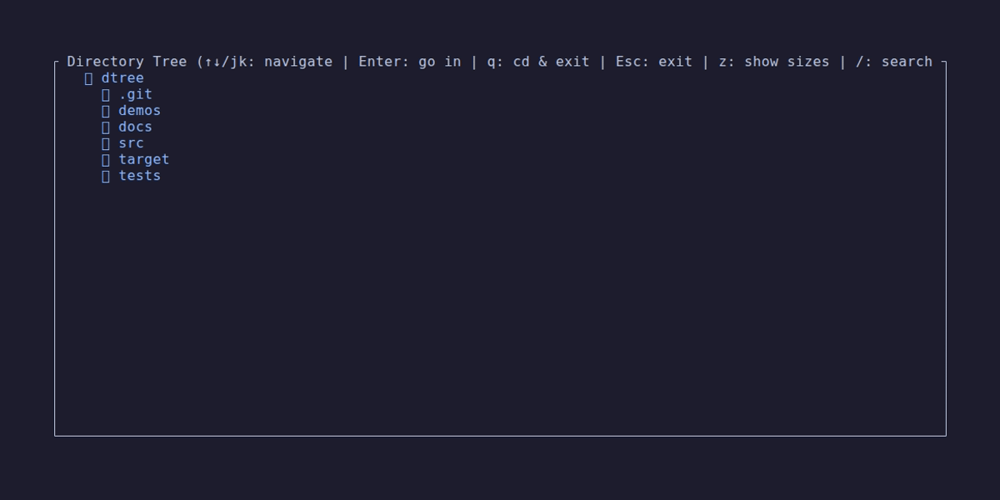
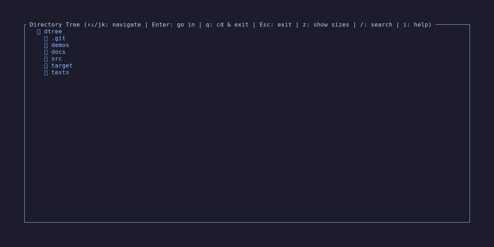
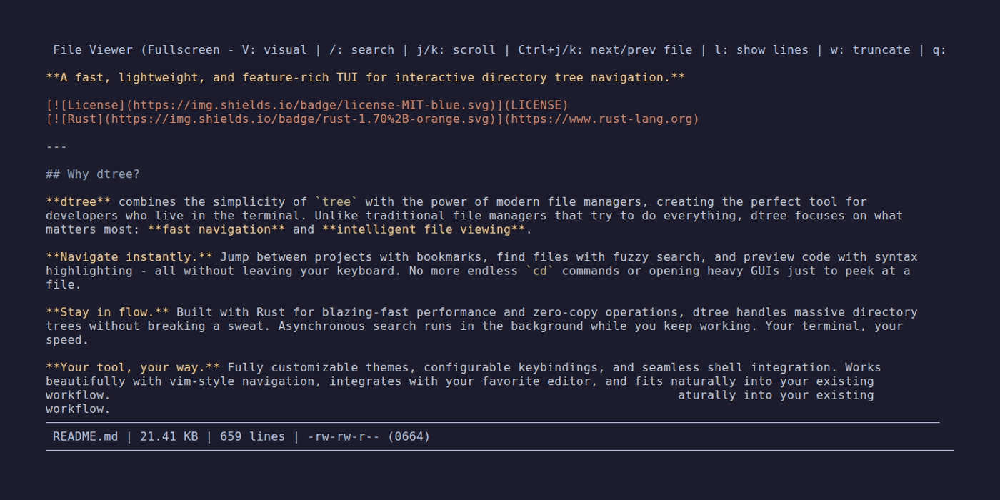
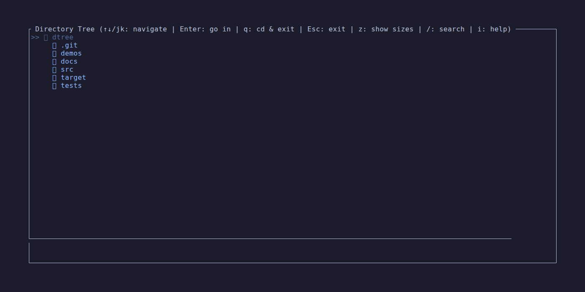
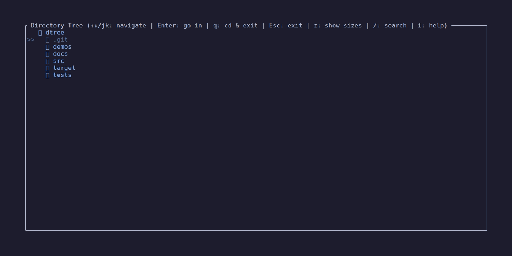

# dtree - Demo Gallery

Visual demonstrations of dtree features and functionality.

---

## Tree Navigation

Navigate through directories with vim-style keybindings. Expand/collapse with `l`/`h`, move with `j`/`k`, enter directories with `Enter`.

*Demo: Basic tree navigation and directory exploration*

---

## File Viewer with Syntax Highlighting

Split view with syntax-highlighted file preview. Toggle with `s`, scroll with `Ctrl+j`/`Ctrl+k`, enter fullscreen with `v`.

*Demo: File preview with syntax highlighting and fullscreen mode*

---

## Visual Selection Mode

Vim-style line selection with keyboard (`V` + `j`/`k`) or mouse. Copy selected lines to clipboard with `y`.

*Demo: Visual selection mode for copying text*

---

## Fuzzy Search

Two-phase search: quick local + deep background. Normal (`/query`) and fuzzy (`//query`) modes with ranked results.

*Demo: Search functionality with fuzzy matching*

---

## Bookmarks

Create bookmarks with `m`, manage with CLI (`dt -bm`), jump instantly with `dt bookmarkname`.

*Demo: Creating and using bookmarks*

---

## Key Features Shown

### Navigation Features
- ✅ Vim-style keybindings (j/k/h/l)
- ✅ Tree expansion/collapse
- ✅ Directory traversal
- ✅ Parent navigation (u/Backspace)

### File Viewing
- ✅ Split view mode (s key)
- ✅ Fullscreen viewer (v key)
- ✅ Syntax highlighting (100+ languages)
- ✅ Line numbers (l key)
- ✅ Line wrapping (w key)
- ✅ Scroll navigation (j/k, Ctrl+j/k, Page Up/Down)

### Visual Selection
- ✅ Vim-style line selection (V key)
- ✅ Keyboard navigation (j/k)
- ✅ Mouse scroll support
- ✅ Copy to clipboard (y key)
- ✅ Visual feedback with highlighting

### Search
- ✅ Tree search (/ key)
- ✅ Fuzzy matching (// prefix)
- ✅ Real-time results
- ✅ Background async search
- ✅ Result navigation
- ✅ Jump to file (Enter)

### Bookmarks
- ✅ Create bookmarks (m key)
- ✅ Browse bookmarks (' key)
- ✅ CLI management (dt -bm)
- ✅ Quick navigation
- ✅ Filter mode

---

## More Information

- **[README](../README.md)** - Full documentation
- **[CHEATSHEET](../CHEATSHEET.md)** - Quick reference
- **[Recording Guide](../demos/README.md)** - How to create demos

---

**Back to [README](../README.md)**
